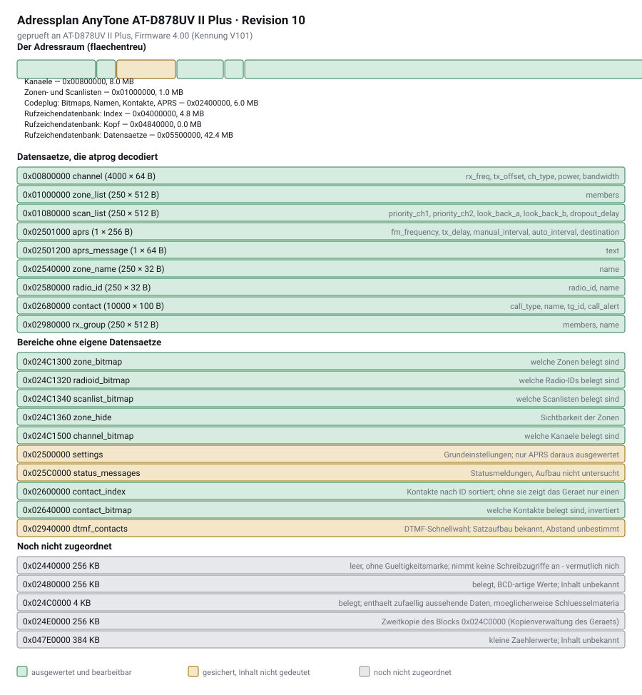

# atprog 1.00 — Programmiersoftware für AnyTone AT-D878UV II Plus

Freie Alternative zur Hersteller-CPS: Codeplug sichern, bearbeiten, prüfen und
zurückschreiben — mit Weboberfläche, Kommandozeile und CPS-kompatiblem
CSV-Austausch.

* **Keine Fremdbibliotheken.** Läuft mit purem Python 3.8+ (macOS/Linux).
  Die serielle Schnittstelle wird über `termios` angesprochen; `pyserial` wird
  benutzt, falls vorhanden (unter Windows nötig).
* **Sicher konstruiert.** Vor jedem Schreiben wird automatisch gesichert,
  geschrieben wird nur differenziell und in einer reinen Schreibsitzung, danach
  wird nach dem Neustart zurückgelesen und byteweise verglichen.
* **Ohne Funkgerät testbar.** Ein eingebauter Simulator spricht das komplette
  Protokoll.

> **Neu hier und kein Computerprofi?** Die
> [Schritt-für-Schritt-Anleitung](ANLEITUNG.md) erklärt Herunterladen,
> Installation und den ersten Start ohne Vorkenntnisse, inklusive
> Doppelklick-Start über `Start-Windows.bat` bzw. `Start-macOS.command`.

---

## Schnellstart

```bash
cd Anytone_programmer     # der entpackte Projektordner
python3 run.py gui
```

Die Oberfläche öffnet sich unter <http://127.0.0.1:8787/>.

Erster Durchlauf ohne Risiko — im Reiter **Funkgerät**:

1. *Simulator → Starten* (virtuelles Gerät)
2. *Gerät erkennen*
3. *Aus Gerät lesen* → die Tabellen füllen sich

Mit echtem Gerät genauso, nur ohne Simulator: Gerät einschalten, USB-Kabel
(mit Datenadern) anstecken, Port wählen, *Gerät erkennen*.

## Kommandozeile

```bash
python3 run.py ports                      # Schnittstellen suchen
python3 run.py info                       # Modell und Firmware anzeigen
python3 run.py status                     # in Sekunden sehen, was belegt ist
python3 run.py read -o backup.atbin       # Codeplug sichern
python3 run.py verify backup.atbin        # Layout gegen das Abbild prüfen
python3 run.py decode backup.atbin --project meins.json --csv-dir csv
python3 run.py validate meins.json        # Plausibilitätsprüfung
python3 run.py export meins.json csv      # CPS-CSV schreiben
python3 run.py import csv meins.json      # CPS-CSV einlesen
python3 run.py apply meins.json backup.atbin -o neu.atbin   # Änderungen ins Abbild
python3 run.py write neu.atbin --backup vorher.atbin
python3 run.py zones                      # Zonen auflisten
python3 run.py zones --show-all           # alle Zonen sichtbar schalten
python3 run.py diff alt.atbin neu.atbin   # Bytes vergleichen (Kalibrierung)
python3 run.py snapshot -o vorher.atbin   # Diagnosebereiche am Stück lesen
python3 run.py explore                    # Speicher nach belegten Bereichen absuchen
python3 run.py peek 0x02980000 --size 0x2000   # Bereich gezielt auslesen
python3 run.py merge a.atbin b.atbin -o c.atbin  # Abbilder zusammenführen
python3 run.py userdb info                # Rufzeichendatenbank im Gerät prüfen
python3 run.py userdb write user.csv --country Germany   # Datenbank schreiben
python3 run.py userdb export -o user.csv  # Datenbank aus dem Gerät sichern
python3 run.py simulate                   # virtuelles Funkgerät starten
```

Installation als Befehl `atprog` (optional):

```bash
pip3 install -e .          # im Projektordner ausführen
```

---

## Was die Software kann

| Bereich | Umfang |
|---|---|
| Sichern / Zurückschreiben | vollständig, blockweise mit Prüfsumme und Rücklesevergleich |
| Kanäle | Name, RX/TX, Typ, Leistung, Bandbreite, CC, Zeitschlitz, Kontakt, Radio-ID, RX-Gruppe, Scanliste, CTCSS/DCS, Sendefreigabe, Nur-RX … |
| Talkgroups / Kontakte | Name, ID, Ruftyp, Rufton; Import der RadioID.net-Nutzerliste |
| Zonen | Name, Mitglieder, A-/B-Kanal und **Sichtbarkeit** (`zones --show-all`) |
| Scanlisten, RX-Gruppenlisten, Radio-IDs | anlegen, bearbeiten, prüfen |
| CSV | liest und schreibt die Dateien der Original-CPS (`Channel.CSV`, `TalkGroups.CSV`, `Zone.CSV`, `ScanList.CSV`, `ReceiveGroupCallList.CSV`, `RadioIDList.CSV`) |
| Prüfung | Frequenzbereiche, doppelte Namen, fehlende Verweise, Gerätegrenzen (4000 Kanäle, 250 Zonen, 10000 Kontakte …) |
| APRS | Bake bearbeiten: Rufzeichen und SSID, Ziel, Pfad, Sendefrequenz, Symbol, Leistung, Intervalle, Bakentext |
| DMR-ID-Datenbank | Rufzeichenliste aus einer radioid.net-CSV erzeugen, ins Gerät schreiben und wieder auslesen — ohne Hersteller-CPS |

### Kanäle ändern und ins Gerät bringen

```bash
python3 run.py read -o backup.atbin                      # 1. sichern
python3 run.py decode backup.atbin --project meins.json  # 2. Datenmodell gewinnen
#    3. bearbeiten (Oberfläche, oder CSV-Export/-Import)
python3 run.py apply meins.json backup.atbin -o neu.atbin  # 4. ins Abbild patchen
python3 run.py write neu.atbin                           # 5. nur geänderte Blöcke senden
```

Schritt 4 verlangt eine bestandene Layout-Prüfung und ein fehlerfreies Projekt;
`--force` überstimmt beides bewusst. In der Oberfläche entspricht das dem Knopf
*Änderungen ins Abbild* im Reiter **Funkgerät**.

Ein Beispiel aus dem Testlauf: ein umbenannter Kanal mit neuer Frequenz ergab
genau **einen** geschriebenen 64-Byte-Block bei 6105 übersprungenen.

Beim Umbenennen eines Kanals oder Kontakts zieht die Oberfläche alle Verweise
automatisch nach (Zonen, Scanlisten, A-/B-Kanal, RX-Gruppen). Wer Projektdateien
von Hand bearbeitet, bekommt fehlende Verweise von `validate` gemeldet.

### Zusammenspiel mit der Original-CPS

Beide Wege funktionieren nebeneinander:

* **CSV-Weg (empfohlen, firmwareunabhängig):** hier bearbeiten → CSV schreiben →
  in der CPS einlesen → mit der CPS schreiben.
* **Direkter Weg:** `read` → bearbeiten → `write`. Vollständiges Sichern und
  Zurückschreiben ist immer sicher (siehe unten).

---

## Wie geschrieben wird

Das Funkgerät sammelt Schreibzugriffe und übernimmt sie erst, wenn die Sitzung
mit `END` endet. Wer dazwischen zurückliest, sieht den alten Inhalt **und
verwirft dabei den Puffer** — der Schreibvorgang verpufft dann folgenlos.
atprog trennt deshalb strikt in drei Sitzungen:

1. Vergleichsstand lesen
2. nur schreiben, ohne ein einziges Zwischenlesen
3. Neustart abwarten, neu verbinden, zurücklesen und vergleichen

Das läuft automatisch ab; im Fortschritt steht jeweils „Sitzung 1 von 3" und so
weiter. Übertragen werden nur Blöcke, die sich unterscheiden — eine
Rücksicherung des unveränderten Codeplugs schreibt null Blöcke.

Zwei Dinge macht atprog dabei von sich aus, weil das Gerät sie sonst falsch
deutet: Es schreibt ausschließlich vollständige, ausgerichtete 16-Byte-Blöcke
(angebrochene quittiert das Gerät nicht einmal), und es berechnet vor jedem
Zurückschreiben die Kontakt-Indextabelle neu — ohne sie zeigt das Funkgerät
hinterher nur einen einzigen Kontakt.

## Sicherheitskonzept

1. **Sicherung zuerst.** `write` liest vor dem Schreiben den aktuellen Stand und
   legt ihn als Datei ab (in der Oberfläche automatisch als `auto-backup-*.atbin`).
2. **Differenziell schreiben.** Übertragen werden nur Blöcke, die sich vom
   aktuellen Geräteinhalt unterscheiden. Ein unverändertes Abbild schreibt
   null Blöcke.
3. **Patchen statt Neuschreiben.** Beim Ändern einzelner Felder werden nur die
   im Layout beschriebenen Bytes verändert; unbekannte Bytes eines Datensatzes
   bleiben unangetastet.
4. **Rücklesevergleich — aber in einer eigenen Sitzung.** Nach dem Schreiben
   wird `END` gesendet, der Neustart abgewartet und erst dann jeder geschriebene
   Block zurückgelesen und byteweise verglichen. Ein Vergleich *innerhalb* der
   Schreibsitzung würde den Puffer des Geräts verwerfen (siehe
   [docs/PROTOKOLL.md](docs/PROTOKOLL.md)).
5. **Feldweises Schreiben nur nach bestandener Prüfung.** `apply` verweigert die
   Arbeit, solange die Round-Trip-Prüfung nicht für jeden Datensatz aufgeht.
6. **Round-Trip-Prüfung des Layouts.** `verify` decodiert jeden Datensatz und
   codiert ihn wieder. Nur wenn das Ergebnis byteidentisch ist, beschreibt das
   Layout diese Firmware korrekt.

## Was im Speicher wo liegt



Grün ist ausgewertet und bearbeitbar, gelb wird gesichert, ohne dass der Inhalt
gedeutet ist, grau ist noch nicht zugeordnet. Im Terminal zeigt
`python3 run.py map` dasselbe, und `python3 tools/adressplan_svg.py` erzeugt die
Grafik neu, wenn sich der Adressplan ändert.

**Drei Zahlen, die man nicht verwechseln sollte** (ausführlich in
[docs/VERSIONEN.md](docs/VERSIONEN.md)):

| Bezeichnung | Beispiel | Was es ist |
|---|---|---|
| Programmversion | `atprog 1.00` | diese Software; Iterationen zählen 1.01, 1.02, … |
| Gerätefirmware | `4.00`, Kennung `V101` | was im Funkgerät läuft |
| Adressplan-Revision | `r10` | die Beschreibung des Gerätespeichers in `atprog/layouts/` |

## Was geprüft ist — und was nicht

Ehrlich abgegrenzt:

* **Vollständig getragen** ist der Transportweg: Protokoll, Prüfsummen,
  Blocklesen/-schreiben, Sicherung, differenzielles Schreiben, Rücklesevergleich,
  CSV-Import/Export, Plausibilitätsprüfung, Oberfläche. Das ist durch die
  Testsuite abgedeckt (74 Tests, inklusive komplettem Lauf gegen das simulierte
  Gerät) und an echter Hardware belegt: vollständige Rücksicherung eines
  AT-D878UV II Plus mit null Prüfabweichungen.
* **Firmwareabhängig** ist die Byte-Bedeutung einzelner Felder. Das
  mitgelieferte Layout (`atprog/layouts/d878uv2plus.json`, Version 4.1) wurde
  an einem echten AT-D878UV II Plus (Kennung `ID878UV2`) überprüft: alle
  Kanäle, Kontakte, Zonen, Scanlisten und Radio-IDs dieses Geräts lassen sich
  byteidentisch rekonstruieren. `python3 run.py verify backup.atbin` sagt
  Ihnen dasselbe für **Ihr** Gerät. Meldet dort etwas nicht `OK`, verweigert
  `apply` das feldweise Zurückschreiben — der Weg „sichern → CSV → CPS"
  funktioniert davon unabhängig.
* **Gesichert, aber nicht ausgewertet** werden Grundeinstellungen,
  Statusmeldungen und DTMF-Kontakte — sie überstehen also Sicherung und
  Rücksicherung, erscheinen aber nicht als bearbeitbare Tabelle.
* **Noch unbestimmt** sind einige belegte Seiten (`0x02480000`, `0x024E0000`,
  `0x02600000`). Suchen lassen sie sich mit `python3 run.py explore` und
  `python3 run.py peek`; siehe [docs/PROTOKOLL.md](docs/PROTOKOLL.md).

### Layout nachkalibrieren

Ein unbekanntes Feld findet man in Minuten:

```bash
python3 run.py read -o vorher.atbin     # Ausgangszustand sichern
# genau eine Einstellung am Gerät oder in der CPS ändern
python3 run.py read -o nachher.atbin
python3 run.py diff vorher.atbin nachher.atbin
```

`diff` benennt Adresse, betroffenen Datensatz und — falls schon bekannt — das
Feld. Eigene Layouts legt man als `~/.atprog/<name>.json` ab; sie haben Vorrang
vor den mitgelieferten.

---

## Dateien

| Endung | Inhalt |
|---|---|
| `.atbin` | Speicherabbild des Geräts (Segmente + Metadaten), vollständig zurückschreibbar |
| `.json` | Projektdatei (lesbares Datenmodell: Kanäle, Zonen, Talkgroups …) |
| `.CSV` | Austauschformat der Original-CPS |

Unbekannte CSV-Spalten bleiben beim Import erhalten und werden beim Export
wieder ausgegeben — CPS-Einstellungen, die diese Software nicht modelliert,
gehen also nicht verloren.

## Rufzeichendatenbank (wer sendet gerade?)

Die Liste, die im Display Rufzeichen und Namen des Gegenübers zeigt, ist **kein
Teil des Codeplugs** — sie liegt in einem eigenen Speicherbereich und fasst rund
200 000 Einträge. atprog kann sie erzeugen, schreiben und auslesen:

```bash
python3 run.py userdb fetch --count            # aktuelle Liste von radioid.net holen
python3 run.py userdb info                                  # was ist geladen?
python3 run.py userdb build user.csv -o db.atbin --country Germany
python3 run.py userdb write --image db.atbin                # übertragen
python3 run.py userdb export -o gesichert.csv               # zurücklesen
```

In der Oberfläche erledigt das der Reiter **Rufzeichen-DB**: *Gerät prüfen*,
*Auslesen* und *Schreiben*, jeweils mit Fortschrittsanzeige. Darunter liegt ein
Betrachter für gesicherte Listen — Datei laden, blättern und über alle Felder
suchen (Rufzeichen, Name, Ort, Region, Land, DMR-ID; mehrere Suchbegriffe
werden UND-verknüpft). Auch 300 000 Einträge sind damit flüssig zu
durchsuchen: Laden unter einer Sekunde, Suche im Bereich von Millisekunden,
Speicherbedarf rund 110 MB. Eine frisch ausgelesene Liste steht dort sofort
bereit.

Die Liste muss man nicht von Hand besorgen: `userdb fetch` lädt sie von
<https://database.radioid.net/static/users.json> (dieselbe Quelle wie qdmr) —
in der Oberfläche der Knopf *Aktuelle Liste holen*. Sowohl das JSON als auch
die CSV von radioid.net werden gelesen; das JSON wird satzweise ausgewertet,
300 000 Einträge aus 46 MB in knapp zwei Sekunden. Sollte der Abruf einmal
abgewiesen werden (die Seite setzt einen Bot-Schutz ein), nennt atprog die
Adresse für den Download von Hand.

Filter: `--country Germany`, `--prefix 262,263`, `--limit N`. Ohne Filter wird
die komplette Datei übernommen (Gerätegrenze 500 000 Einträge).

Die Ablage unterscheidet sich zwischen AT-D878UV II Plus und dem älteren
D868UV; atprog erkennt am Gerät, welche gilt, und `--geometry` überstimmt das
bei Bedarf.

Das Gerät nimmt beim **Schreiben nur 16 Byte je Kommando** an, beim Lesen 64.
An echter Hardware gemessen (rund 225 Kommandos je Sekunde):

| | Tempo | Codeplug (1,65 MB) | Rufzeichen-DB (17 MB) |
|---|---|---|---|
| Lesen | ~14 kB/s | ~2 min | ~20 min |
| Schreiben | ~3,5 kB/s | wenige Sekunden (nur geänderte Blöcke) | ~80 min |

Gefilterte Listen sind entsprechend schneller: Deutschland etwa 6 Minuten,
Europa rund 20. Vor dem Schreiben misst atprog die tatsächliche Kommandorate
und nennt die erwartete Dauer; währenddessen zeigen Fortschrittsbalken und
Oberfläche die **verbleibende Zeit** aus der laufenden Messung.

Schreibt man eine kleinere Liste als die bisherige, werden die überzähligen
Indexeinträge gelöscht; danach prüft atprog Kopfblock und Stichproben zurück.

Codeplug und Datenbank liegen in getrennten Speicherbereichen: `userdb write`
kann Kanäle und Zonen nicht beschädigen, und `write` (Codeplug) lässt die
Datenbank unberührt.

## Beispieldaten

```bash
python3 samples/make_sample.py     # erzeugt samples/beispiel-projekt.json + samples/csv/
python3 run.py validate samples/beispiel-projekt.json
```

## Tests

```bash
python3 -m unittest discover -s tests -v
```

Der Ende-zu-Ende-Test startet ein virtuelles Funkgerät (pty), liest den
Codeplug, prüft das Layout per Round-Trip, decodiert, geht über CSV und
Projektdatei und schreibt eine Änderung differenziell zurück.

## Aufbau

```
atprog/
  serialport.py   Serielle Schnittstelle (termios, optional pyserial)
  protocol.py     AnyTone-Programmierprotokoll (PROGRAM/R/W/END, Prüfsummen)
  image.py        Sparse-Speicherabbild, Containerdatei, Blockvergleich
  layout.py       Adressplan (Adressen, Datensätze, Felder)
  layouts/        Layoutbeschreibungen als JSON
  codec.py        Binär-Codec, patchendes Schreiben, Bitmaps
  models.py       Datenmodell + Plausibilitätsprüfung
  csvio.py        CPS-kompatibles CSV
  device.py       Sichern, Zurückschreiben, Verifizieren, Decodieren
  webui.py        HTTP-Server und JSON-Schnittstelle
  web/            Oberfläche (HTML/CSS/JS, ohne Bibliotheken)
  simulator.py    Virtuelles Funkgerät für Tests
  cli.py          Kommandozeile
```

## Dank und Quellen

atprog enthält keinen fremden Quelltext, stützt sich aber auf das
veröffentlichte Wissen anderer Projekte. Ehre, wem Ehre gebührt:

* **[qdmr](https://github.com/hmatuschek/qdmr)** von Hannes Matuschek (DM3MAT):
  Referenz für das AnyTone-Programmierprotokoll (`lib/anytone_interface.cc`)
  und für die Ablage der Rufzeichendatenbank des D868UV
  (`lib/d868uv_callsigndb.hh`). An dieser Beschreibung wurde das Protokoll
  gegengeprüft; die Abweichungen des AT-D878UV II Plus sind in
  [docs/PROTOKOLL.md](docs/PROTOKOLL.md) dokumentiert.
* **[dmrconfig](https://github.com/sergev/dmrconfig)** von Serge Vakulenko:
  zweite unabhängige Referenz für das Kommandoformat (`serial.c`).
* **[radioid.net](https://radioid.net/)**: Quelle der DMR-Nutzerliste, die
  `userdb fetch` für die Rufzeichendatenbank lädt.
* **[pyserial](https://github.com/pyserial/pyserial)**: wird als serielles
  Backend genutzt, falls installiert (unter Windows erforderlich).
* Die CSV-Formate folgen der Original-CPS von AnyTone, damit beide Programme
  dieselben Dateien lesen und schreiben können.

Alle Feldlagen und Protokolleigenheiten wurden zusätzlich an einem echten
AT-D878UV II Plus nachgemessen; die Messungen samt widerlegter Vermutungen
stehen in [docs/PROTOKOLL.md](docs/PROTOKOLL.md).

Liebe Grüße, Jens (DA6JEY)

## Hinweise

* Das Gerät muss zum Programmieren eingeschaltet und über ein USB-Kabel **mit
  Datenadern** verbunden sein.
* Firmware-Updates gehören nicht zum Umfang dieser Software — dafür bleibt das
  Herstellerwerkzeug zuständig.
* Senden nur auf Frequenzen, für die eine Zulassung vorliegt. Die
  Plausibilitätsprüfung warnt bei Frequenzen außerhalb der Gerätebereiche,
  ersetzt aber keine Prüfung des Bandplans.
* Vor dem ersten Zurückschreiben lohnt eine Vollsicherung (`read --full`).
  Sicherungen, die mit einem Layout älter als 4.9 entstanden sind, enthalten
  weder die Zonen-Sichtbarkeit noch den Kontakt-Index noch die
  APRS-Einstellungen — sie sind zum Zurückschreiben also unvollständig.
* Keine Gewähr. Nutzung auf eigene Verantwortung — die eingebauten Sicherungen
  sind sorgfältig, aber kein Ersatz für ein eigenes Backup.
